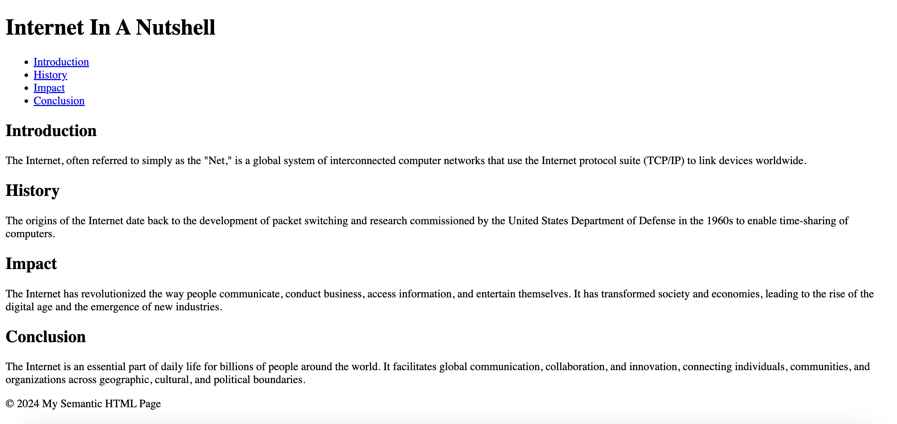

# Day 1: Semantic HTML

This project is a simple HTML page showcasing the use of semantic HTML elements. It includes a header, navigation, and sections about the Internet written using semantic elements.

## Semantic HTML Elements Used

- `<header>`: Represents introductory content, typically contains headings, logo, or other introductory elements.
- `<nav>`: Defines a set of navigation links.
- `<main>`: Represents the main content of the document.
- `<section>`: Represents a generic section of a document or application.
- `<footer>`: Represents the footer of the document or a section.

## Article: The Internet: A Brief Overview

The article provides a brief overview of the Internet, its history, and its impact on society and economies.

## How to View

Open the `index.html` file in your web browser to view the page.

## Screenshot

