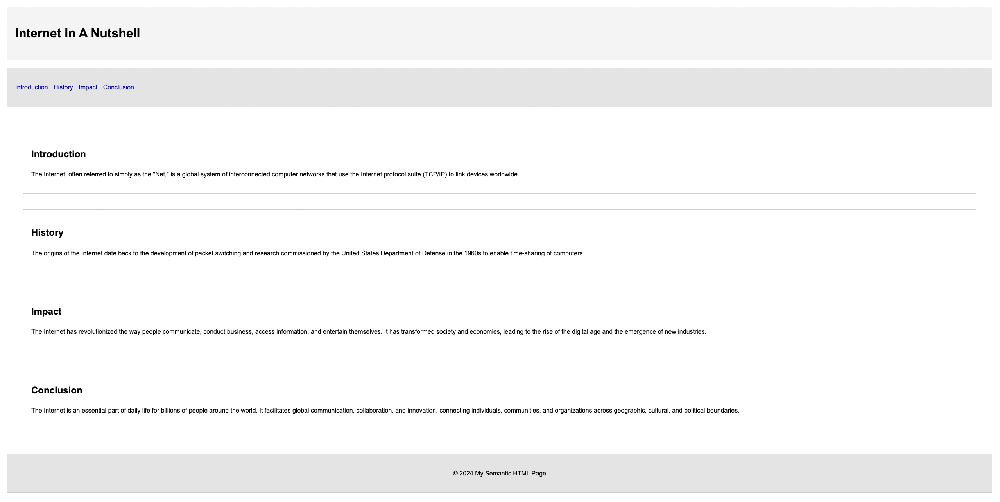

# Day 2: Styled Semantic HTML

This project enhances the semantic HTML page from Day 1 by adding CSS for styling. It demonstrates the use of external CSS to style various HTML elements.

## CSS Concepts Used

- **Selectors**: Styling elements by their tag, class, or ID.
- **Box Model**: Understanding margin, padding, border, and content.
- **Flexbox**: Basic use of flexbox for layout.
- **Typography**: Setting font family and line height.

## How to View

1. Open the `index.html` file in your web browser to view the styled page.
2. The `styles.css` file contains the CSS used to style the HTML elements.

## Screenshot

