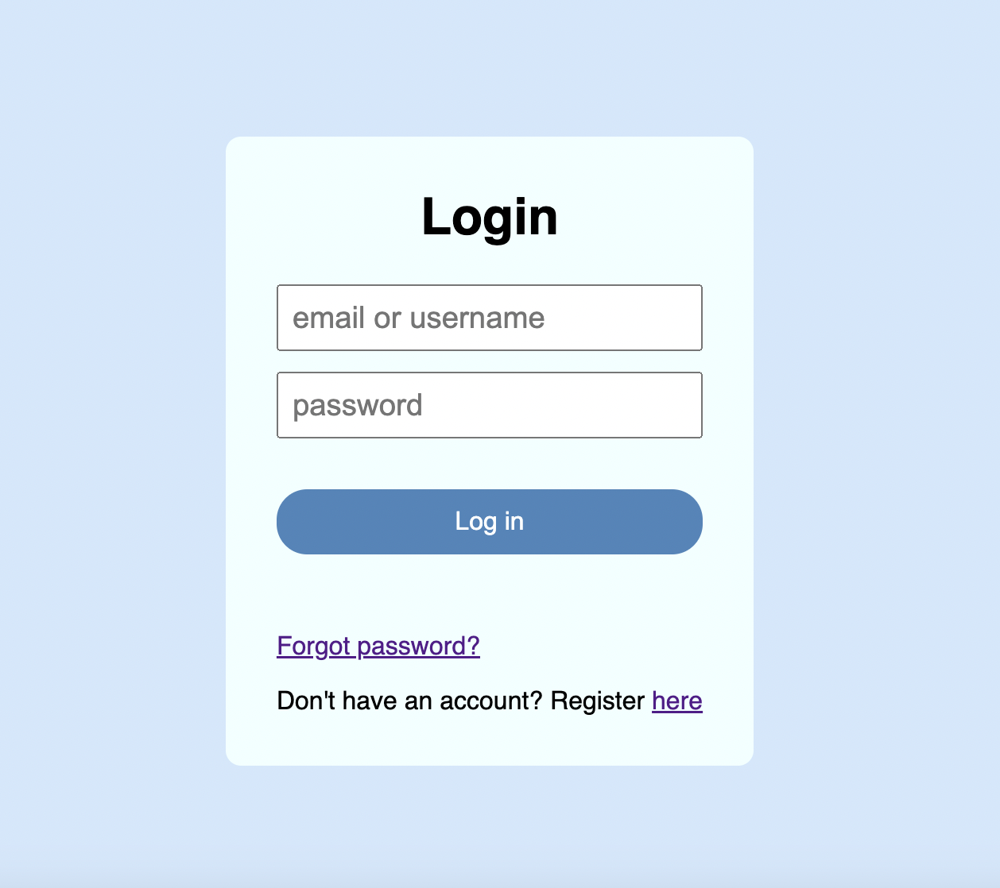

# Day 3: Simple Login Page

This project is a simple login page created using HTML and CSS. It includes fields for the username and password, as well as a login button.

## Project Structure

day-03/
├── index.html
├── styles.css
└── README.md

## Features

- **Form Elements**: The page contains a form with input fields for the username and password, as well as a submit button.
- **Basic Styling**: CSS is used to style the form, input fields, and button for a clean and simple design.

## How to View

1. Clone the repository.
2. Open the `index.html` file in your web browser to view the login page.

## Learning Outcomes

- Understand how to create and structure a basic form in HTML.
- Learn basic CSS for styling form elements.
- Practice aligning elements using CSS flexbox.

## Screenshots

