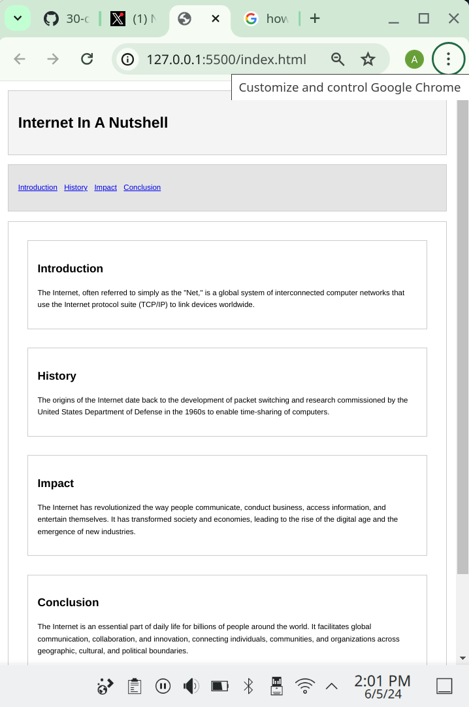

# Day 3: Responsive Semantic HTML

This project enhances the styled semantic HTML page from Day 2 by making it responsive using CSS media queries. It demonstrates how to adjust the layout and styling for different screen sizes to ensure the webpage is mobile-friendly.

## CSS Concepts Used

- **Media Queries**: Applying different styles for different screen sizes.
- **Responsive Design**: Ensuring the webpage looks good on all devices, from desktops to smartphones.

## How to View

1. Open the `index.html` file in your web browser to view the responsive page.
2. Resize the browser window or view the page on different devices to see the responsive design in action.

## Semantic HTML Elements

- `<header>`
- `<nav>`
- `<main>`
- `<section>`
- `<footer>`

## Screeenshot

