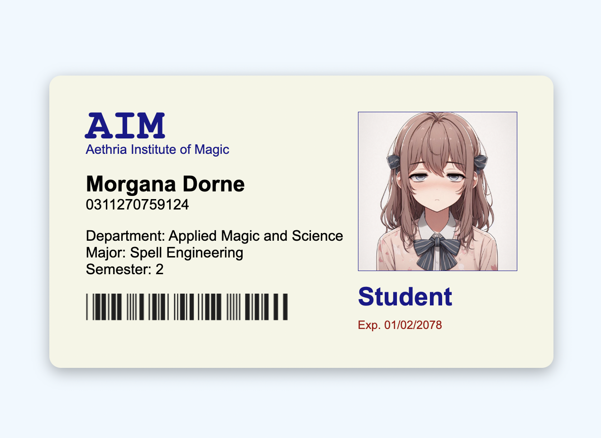

# Day 5: University Student ID Card

This project is a fictional magic university student ID card created using HTML and CSS. The ID card includes elements such as the student's name, photo, university name, and other details.

## Features

- **Student Details**: Includes student name, university name, and other fictional details.
- **Photo Section**: Placeholder for the student's photo. The photos itself is AI generated. I've even included more photos of characters so you can make different versions.
- **Card Styling**: CSS is used to style the ID card with a modern look.

## How to View

1. Clone the repository.
2. Open the `index.html` file in your web browser to view the student ID card.

## Learning Outcomes

- Practice using HTML to structure an ID card.
- Learn to style a card layout using CSS.
- Explore creative design elements to make the card visually appealing.

## Screenshots

